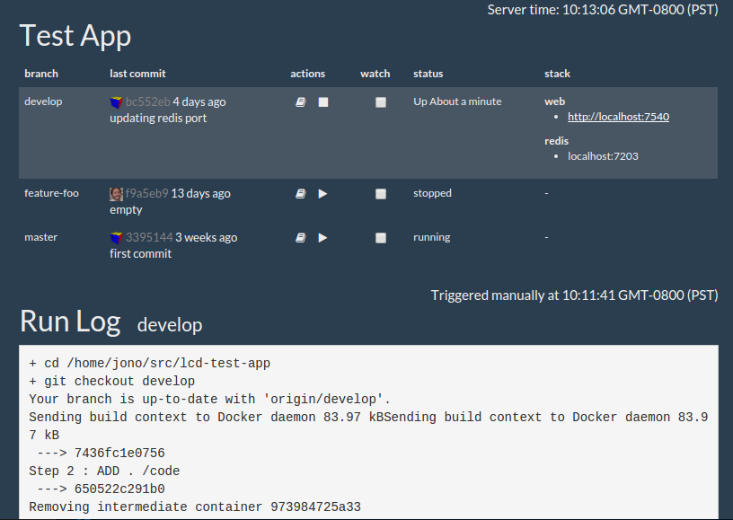

# Branchr

A continuous feature branch monitoring tool for web applications in development.

# Screenshot

## Requirements
* Docker >= 1.10
* docker-compose >= 1.6
* git
* [Meteor](https://www.meteor.com/install) (for development only)

Make sure docker is setup to [run without needing sudo](http://askubuntu.com/questions/477551/how-can-i-use-docker-without-sudo).

## Demo

The demo will pull down a sample app and run Branchr for you. Run the project using Docker or in development mode (see below). Then visit http://localhost:3000

### In development
`demo/run.sh dev`

### Using Docker
`demo/run.sh docker`

## Usage

The app you want to run should be managed by git, have a Docker image for it and a compose file. Compose file needs to have environment variables for ports...

It is recommended that you connect to your remote git repo using an ssh key file with no pass phrase.

TODO: explain settings.json

## TODO

* queue found git changes so builds dont fall over each other. perhaps:  https://atmospherejs.com/vsivsi/job-collection
* if no queue, write checkouts to separate directories, as capistrano does with git archive?
* allow config to check for branches and commits locally or remotely
* timeout random port checking
* parse compose file instead of setting ports in config
* stop a running stack when its branch disappears
* show when git last commit is different then the last deployed checksum
* growl git updates or log them somewhere?
* animated screenshot for readme - FFcast, gifify, LICEcap, silentcast?
